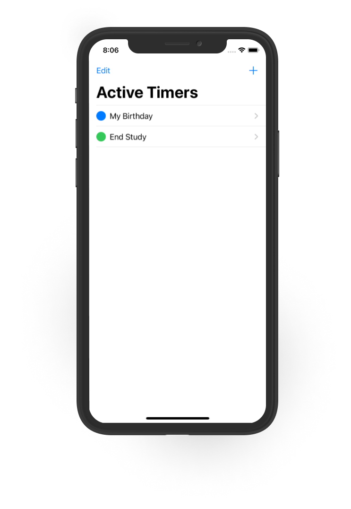
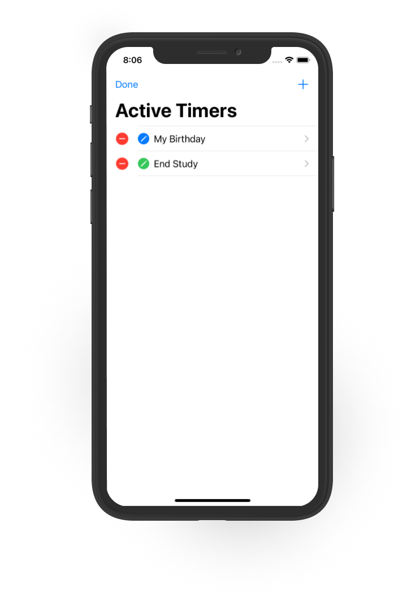
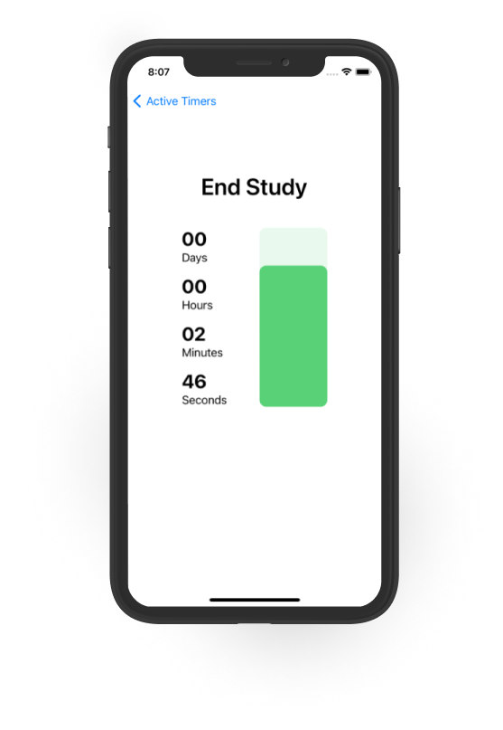
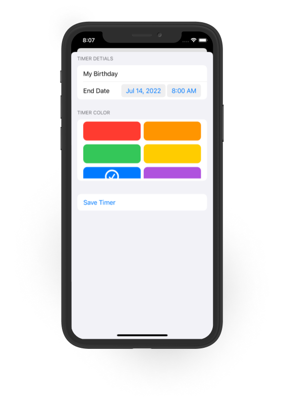

# Countdown App
A simple countdown app using SwiftUI.
This is my first Swit project, I made this for a [Codementor Challenge]([http](https://www.codementor.io/projects/mobile/countdown-mobile-app-bjzn08zcon)).

## Features
  ✅  Create a countdown using a specific end date and time.
    
  ✅  Customize countdowns with a title and color.
    
  ✅  Data persistance using `UserDefaults`.
    
  ✅  Edit and delete created timers.

## Screenshots
Timers List            |  Timer List (Editing Mode)
:-------------------------:|:-------------------------:
  |  

Timer Details            |  Timer Form
:-------------------------:|:-------------------------:
  |  

